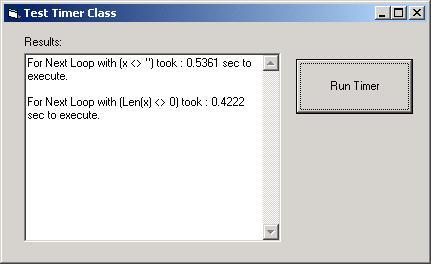



## High Resolution Timer

### Description

Did you ever what to time something up to thousands of a second. This is not possible by using time() and timers at all. This little class (only uses 3 variables) can time up to a thousands of a second with your CPU clock frequency. There's a little example program also shows the difference between using:

{if VarX <> "" then} AND {if Len(VarX) <> 0 then}. The last one will execute between 20-25% faster. The timer can show this in fractions of a second.
 
### More Info
 

             |
---                |---
**Submitted On**   |2001-04-23 10:14:04
**By**             |[Riaan Aspeling](https://github.com/Planet-Source-Code/PSCIndex/blob/master/ByAuthor/riaan-aspeling.md)
**Level**          |Advanced
**User Rating**    |4.8 (24 globes from 5 users)
**Compatibility**  |VB 5\.0, VB 6\.0
**Category**       |[Miscellaneous](https://github.com/Planet-Source-Code/PSCIndex/blob/master/ByCategory/miscellaneous__1-1.md)
**World**          |[Visual Basic](https://github.com/Planet-Source-Code/PSCIndex/blob/master/ByWorld/visual-basic.md)
**Archive File**   |[High Resol187194232001\.zip](https://github.com/Planet-Source-Code/riaan-aspeling-high-resolution-timer__1-22625/archive/master.zip)

